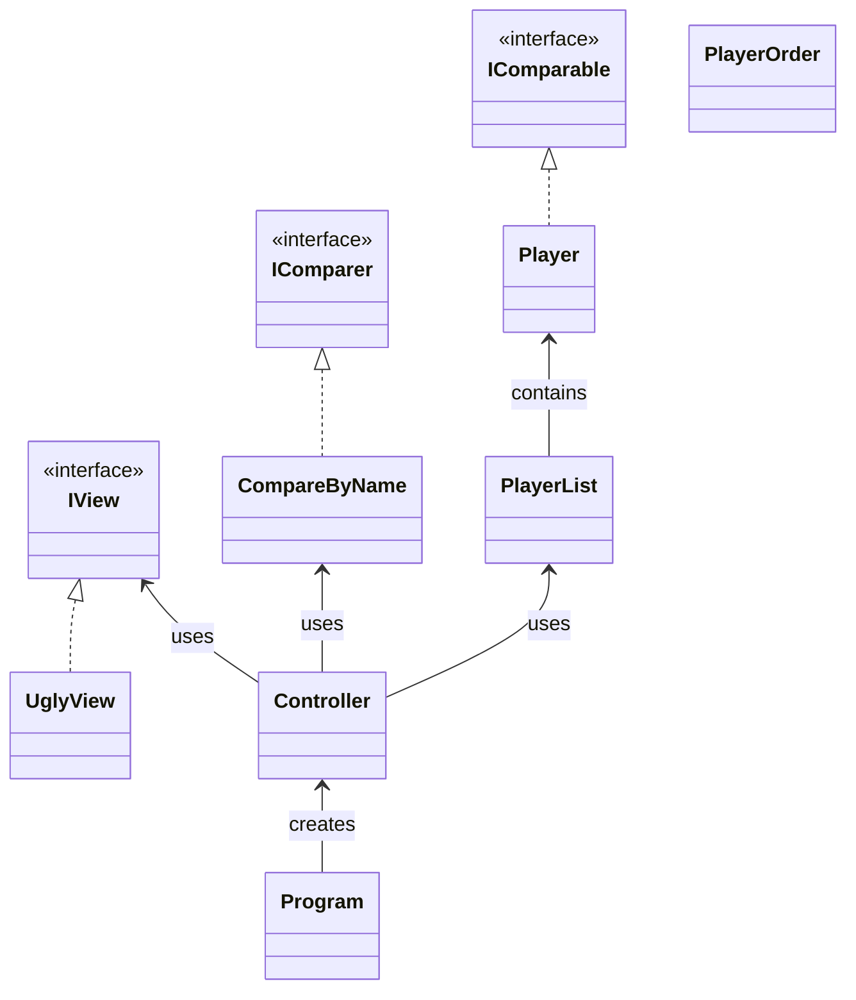

```mermaid
classDiagram

    class IView {
        <<interface>>
    }

    class IComparer {
        <<interface>>
    }

    class IComparable {
        <<interface>>
    }

    class CompareByName
    
    class Player
    class PlayerList
    class PlayerOrder
    class UglyView

    class Controller

    class Program

    IView <|.. UglyView
    IComparer <|.. CompareByName
    IComparable <|.. Player

    
    Player <-- PlayerList : contains
    PlayerList <-- Controller : uses
    IView <-- Controller : uses
    CompareByName <-- Controller : uses
    Controller <-- Program : creates


```
